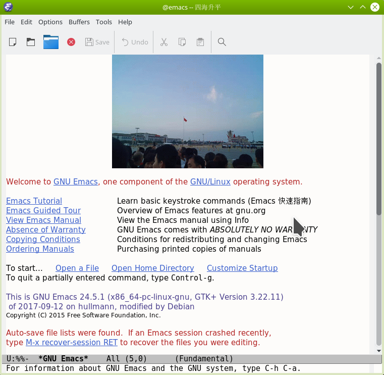

dotemacsA
==============================

THE available emacs configure dotemacsA

Keys
----

#### neotree

Open (toggle) NeoTree:  ```<F8>```

Only in Neotree Buffer:

```
n next line, p previous line。
SPC or RET or TAB Open current item if it is a file. Fold/Unfold current item if it is a directory.
U Go up a directory
g Refresh
A Maximize/Minimize the NeoTree Window
H Toggle display hidden files
O Recursively open a directory
C-c C-n Create a file or create a directory if filename ends with a ‘/’
C-c C-d Delete a file or a directory.
C-c C-r Rename a file or a directory.
C-c C-c Change the root directory.
C-c C-p Copy a file or a directory.
```

Setup
-----

    git clone https://github.com/dist1/dotemacsA.git
    cd dotemacsA
    ./install-linux

Screenshot
----------


