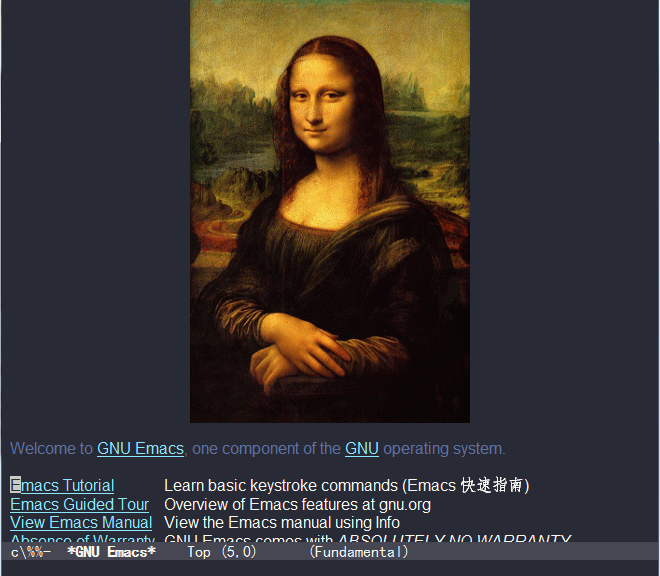

LTaoist's Emacs Configure File 
==============================

Just for backup :-)

Setup
-----

    git clone https://github.com/LTaoist/dot-emacs.git
    cd dot-emacs
	cp .emacs ~/
	cp -r .emacs-elisp ~/

Screenshot
----------

